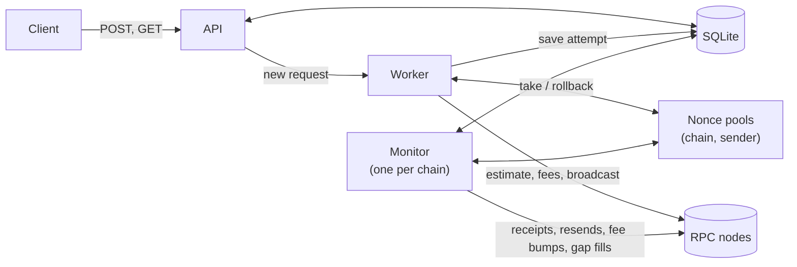
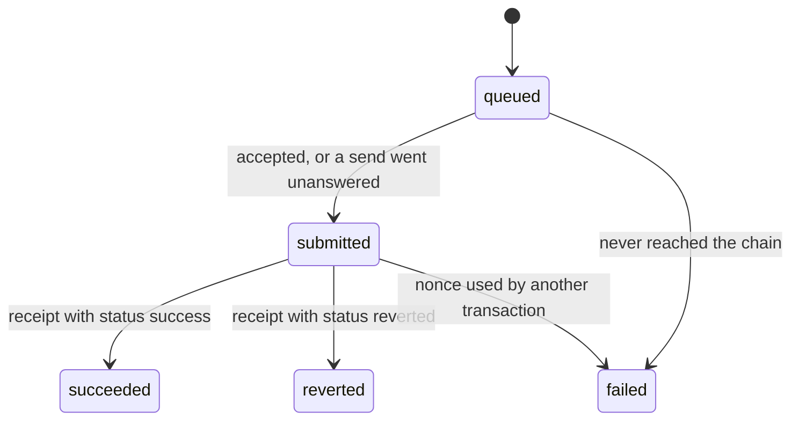

# EVM Transaction Executor

An HTTP service that sends transactions to EVM chains from accounts whose keys it holds. It handles nonces, gas, retries and receipts, so clients only have to say what to send.

A client posts `{ chainId, sender, to, value, data }` and gets an id back immediately. The service then:

1. estimates gas and prices the fee,
2. assigns a nonce, signs and broadcasts,
3. watches the transaction until a receipt appears, resending it or raising its fee if it gets stuck.

The client polls with the id to get the result.

> **Status:** the design below is agreed, and implementation has started. So far: tooling, per-chain config, env parsing and startup checks, the signer registry, the SQLite store, the nonce pool, logging and the test harness. The API, worker and monitor aren't built yet. Some details will be settled during implementation; see [Open items](#open-items).

## Development

Requires Node.js 24+ and [Foundry](https://book.getfoundry.sh/)'s `anvil`, which the integration tests start themselves.

```bash
npm install
```

```bash
npm test
```

```bash
npm run typecheck
```

To run the service, copy `.env.example` to `.env`, fill it in, then run:

```bash
npm run dev
```

## Stack

| Concern | Choice |
|---|---|
| Language and runtime | TypeScript on Node.js 24 |
| HTTP | Express |
| Chain access and signing | viem |
| Persistence | SQLite (better-sqlite3) |
| Validation | zod |
| Logging | pino |
| Tests (proposed) | vitest, with anvil as a local chain |

## How it works



| Component | Responsibility |
|---|---|
| **API** | Validates requests, enforces idempotency, stores each request as `queued`, and serves status. Never calls an RPC. |
| **Worker** | Takes each queued request through: estimate gas → price fees → take nonce → sign → save attempt → broadcast. Works on at most `maxInFlightPerSender` requests per sender at a time. |
| **Nonce pools** | One per (chain, sender). Hands out the smallest free nonce. Takes a nonce back only when no node can have the transaction. |
| **Monitor** | One loop per chain. Looks for receipts, resends or fee-bumps stuck transactions, fills nonce gaps, and detects nonces used outside the service. |
| **Store** | SQLite tables `transactions` and `attempts`. The source of truth: nonce pools are rebuilt from it after a restart. |
| **Chain registry** | One config file per chain, plus `RPC_URL_<chainId>` env vars. Checked against each RPC at startup. |
| **Signer registry** | Maps each sender address to a viem `Account`, built from `SIGNER_PRIVATE_KEYS`. |

### Life of a request

1. **Accept.** `POST /transactions` checks the body, that the chain and sender are configured, and the idempotency key. It stores the request as `queued` and returns `202` with an id. No RPC calls happen here.
2. **Estimate and price.** Once the sender has a free slot ([ADR 0012][0012]), the worker estimates gas (plus a buffer) and prices the fee. If the estimate reverts, or the fee is above the chain's cap, the request fails here, before anything is signed.
3. **Take a nonce** from the sender's pool. This happens as late as possible, so earlier failures never touch the pool.
4. **Sign and save.** The signed transaction is saved as an *attempt* **before** it's broadcast.
5. **Broadcast.** If a node accepts it, or any send goes unanswered, the request becomes `submitted` and keeps its nonce. If every send is clearly rejected, no node has it, and the nonce is released ([ADR 0009][0009]).
6. **Watch.** On every poll the monitor checks receipts for all of the request's attempts, and replaces a stuck transaction with a higher-fee one at the same nonce. When a receipt appears, the request becomes `succeeded` or `reverted`.

### Statuses



| Status | Meaning | Final |
|---|---|---|
| `queued` | Accepted by the API, not broadcast yet. It may be waiting for a free slot for its sender. | no |
| `submitted` | Broadcast; hash known | no |
| `succeeded` | Mined, and execution succeeded | yes |
| `reverted` | Mined, but execution reverted. Gas was spent and the nonce used. The service doesn't retry it. | yes |
| `failed` | Never made it on chain, so no gas was spent. `error.code` says why. | yes |

## API

### `POST /transactions`

Requires an `Idempotency-Key` header: 1–255 printable ASCII characters. A UUID is recommended.

```json
{
  "chainId": 84532,
  "sender": "0x…",
  "to": "0x…",
  "value": "1000000000000000",
  "data": "0x"
}
```

| Field | Type | Notes |
|---|---|---|
| `chainId` | integer | Must be a configured chain. The spec calls this field `network`; see [ADR 0005][0005]. |
| `sender` | address | Must match one of the configured keys. |
| `to` | address | Required. Contract deployment isn't supported. |
| `value` | string | Wei, as a decimal string. JS numbers lose precision on large amounts. |
| `data` | hex string | Optional. Defaults to `0x`. |

| Case | Response |
|---|---|
| New key | `202 { id, status: "queued" }` |
| Same key, same body | `200` with the existing transaction and an `Idempotent-Replayed: true` header |
| Same key, different body | `422 IDEMPOTENCY_KEY_REUSED` |
| Missing key | `400 IDEMPOTENCY_KEY_MISSING` |
| Invalid body | `400 VALIDATION_ERROR` |
| Chain not configured | `400 UNSUPPORTED_CHAIN`, listing the supported chain ids |
| Sender not configured | `400 UNKNOWN_SENDER` |

### `GET /transactions/:id`

Returns the current state of a request, or `404 NOT_FOUND`. Track requests by this id, not by transaction hash, because a fee bump produces a new hash. Illustrative shape:

```json
{
  "id": "…",
  "status": "succeeded",
  "chainId": 84532,
  "sender": "0x…",
  "to": "0x…",
  "value": "1000000000000000",
  "data": "0x",
  "nonce": 42,
  "gasLimit": "25200",
  "hash": "0x…",
  "attempts": [
    { "hash": "0x…", "maxFeePerGas": "…", "maxPriorityFeePerGas": "…", "broadcastAt": "…" }
  ],
  "receipt": {
    "blockNumber": "…",
    "blockHash": "0x…",
    "gasUsed": "21000",
    "effectiveGasPrice": "…",
    "status": "success"
  },
  "error": null,
  "createdAt": "…",
  "updatedAt": "…"
}
```

`hash` is the attempt that was mined. While the request is still `submitted`, it's the latest attempt.

### `GET /health`

Shows RPC status for each chain. For each sender it shows transactions in flight, queued requests, open nonce gaps, and whether the sender is blocked or has stuck transactions. The exact contents will be settled with the observability work.

### Failure codes

| Code | Meaning |
|---|---|
| `ESTIMATION_REVERTED` | Gas estimation reverted. Includes the decoded revert reason. Nothing was broadcast. |
| `FEE_ABOVE_CAP` | The current base fee plus tip is above the chain's `maxFeePerGasWei`. |
| `RPC_UNAVAILABLE` | The RPC stayed unreachable for the whole pre-broadcast retry window. |
| `INSUFFICIENT_FUNDS` | The node rejected the transaction because the balance can't cover value plus the maximum gas cost. |
| `BROADCAST_REJECTED` | Any other rejection. Includes the node's message. |
| `NONCE_TAKEN` | A transaction from outside the service used this request's nonce. |
| `INTERNAL_ERROR` | Signing or saving failed before anything was sent. |

## Configuration

### Environment

```ini
# One per chain, named by chain id. A comma-separated list sets a fallback order.
RPC_URL_31337=http://127.0.0.1:8545
RPC_URL_84532=https://…

# Comma-separated private keys. Each key's address becomes a sender.
SIGNER_PRIVATE_KEYS=0x…,0x…
```

A chain is enabled when its `RPC_URL_<chainId>` is set. Every sender can be used on every enabled chain.

### Per-chain settings

Each chain has a typed file in `src/config/chains/`. Settings a file leaves out come from shared defaults.

```ts
// src/config/chains/base-sepolia.ts   (the filename is only for humans)
export default {
  chain: baseSepolia,               // viem chain definition; chain.id is the key everywhere
  pollIntervalMs: 2_000,
  stuckAfterMs: 10_000,
  maxInFlightPerSender: 16,
  gas: {
    type: 'eip1559',                // or 'legacy'
    gasLimitBufferPercent: 20,
    baseFeeMultiplier: 2,
    minPriorityFeeWei: 0n,
    maxFeePerGasWei: parseGwei('5'), // example value; set per chain
    bumpPercent: 12.5,
    maxBumps: 5,
  },
} satisfies ChainConfig
```

The ADRs list every default and where it comes from: [0007][0007] for gas, [0008][0008] for retries, [0009][0009] for nonces, [0012][0012] for the in-flight cap.

### Startup checks

The service refuses to start if:

- no chain or no key is configured;
- a key is malformed or duplicated;
- an `RPC_URL_<id>` is set but no config file exists for that chain id;
- a chain's RPC reports a different `eth_chainId` than its config, or can't be reached to check.

## Edge cases

| Scenario | What happens | ADR |
|---|---|---|
| Many concurrent requests from one sender | Up to `maxInFlightPerSender` (default 16) are processed at once, each with its own nonce from the sender's pool. The rest wait as `queued`. | [0009], [0012] |
| A sender's requests must be mined in order | Not guaranteed. Wait for the first to finish, or configure the chain with a cap of 1. | [0012] |
| Client retries a POST after a timeout | The same `Idempotency-Key` returns the original request; no second transaction | [0010] |
| Same key reused with a different body | `422` | [0010] |
| Transaction would revert | Caught by gas estimation: `failed` with `ESTIMATION_REVERTED`, no gas spent | [0007] |
| Fee spike above the chain's cap | `failed` with `FEE_ABOVE_CAP`. Replacement fees are capped too. | [0007] |
| RPC timeouts, rate limits, 5xx on reads | viem retries with backoff, then moves to the next RPC URL | [0008] |
| RPC down before broadcast | Retried for up to 2 minutes, then `RPC_UNAVAILABLE`. Nothing was signed. | [0008] |
| Broadcast unanswered: did the node get it? | Nonce kept and request `submitted`. The monitor finds the receipt or resends the same signed transaction. | [0008], [0009] |
| Resending a transaction the node already has | `already known` counts as success | [0008] |
| Broadcast clearly rejected | Nonce goes back to the pool and is reused by the next request | [0009] |
| Transaction stuck in the mempool | Replaced at the same nonce with higher fees, up to `maxBumps` and within the cap | [0008] |
| Transaction dropped from a mempool | Resent or fee-bumped at the same nonce. The nonce never goes back to the pool. | [0008], [0009] |
| Original mined after a replacement was sent | Receipts are checked for every attempt, so either outcome is recognised | [0008] |
| Rolled-back nonce with no request to fill it | The gap filler sends 0 ETH from the sender to itself at that nonce. It doesn't count toward the per-sender cap. | [0009], [0012] |
| Parallel broadcasts arrive out of order (`nonce too high`) | Nonce rolled back and the request retried shortly after | [0009] |
| Nonce used outside the service | `failed` with `NONCE_TAKEN`; the pool is resynced from the chain | [0001], [0009] |
| Crash between signing and broadcasting | The signed transaction was saved first, so after restart the monitor resends it | [0003] |
| Restart with transactions in flight | Nonce pools are rebuilt from SQLite and the chain | [0009] |
| RPC URL pointing at the wrong chain | The service refuses to start | [0005] |
| Reorg removes a mined transaction | **Not handled.** The first receipt is final. | [0004] |

## Known limitations

- Runs as a single instance, and assumes nothing else sends from its keys ([0001]).
- No reorg handling ([0004]).
- One sender's requests aren't guaranteed to be mined in the order they were sent ([0012]).
- Two dependent transactions sent back to back (approve, then swap) can fail estimation, because the first isn't mined yet ([0007]).
- A sender's queue of waiting requests has no limit ([0012]).
- Node error messages differ between node implementations, so classifying broadcast errors is best effort. Unrecognised errors become `BROADCAST_REJECTED` ([0008]).
- Every configured RPC must be reachable at startup ([0005]).
- No contract deployment, no client-supplied gas or fees, and no batching ([0011]).
- On OP-stack L2s the L1 data fee isn't modelled, so senders need slightly more balance than gas × fee ([0007]).
- Keys come from env vars. Production should use a KMS or a secret manager ([0006]).
- Idempotency keys never expire ([0010]).

## Open items

To settle during implementation:

- **Observability.** Proposed:
  - pino JSON logs carrying `txId`, `chainId`, `sender`, `nonce` and `hash`;
  - the `/health` contents described above;
  - possibly counters by status and by error code.
- **Security beyond keys.** Proposed: zod validation of every request, a limit on request body size, and treating the SQLite file as sensitive ([0003]).
- **Testing.** Proposed:
  - vitest unit tests for the nonce pool, the fee math and error classification;
  - integration tests against anvil, which can reproduce stuck transactions (automatic mining off), dropped transactions (`anvil_dropTransaction`) and fee spikes (`anvil_setNextBlockBaseFeePerGas`).
- **Project layout.**

## Architecture decision records

Each significant decision is recorded in [`docs/adr/`](docs/adr/) with its context, the alternatives considered, and its consequences.

| ADR | Decision |
|---|---|
| [0001] | Single instance; the service is the only user of its keys |
| [0002] | Asynchronous API: `202` and polling |
| [0003] | SQLite; save each signed transaction before broadcasting it |
| [0004] | The first receipt is final |
| [0005] | Chains identified by chain id; one config file per chain |
| [0006] | Private keys from env vars now; KMS or a secret manager in production |
| [0007] | Gas limit and fee pricing |
| [0008] | Retries and failure handling |
| [0009] | Nonce management with a nonce pool |
| [0010] | Required `Idempotency-Key` |
| [0011] | No request batching |
| [0012] | Per-sender in-flight cap; no ordering guarantee |

[0001]: docs/adr/0001-single-instance-exclusive-keys.md
[0002]: docs/adr/0002-async-api-with-polling.md
[0003]: docs/adr/0003-sqlite-save-before-broadcast.md
[0004]: docs/adr/0004-first-receipt-is-final.md
[0005]: docs/adr/0005-chain-configuration.md
[0006]: docs/adr/0006-private-key-handling.md
[0007]: docs/adr/0007-gas-limit-and-fees.md
[0008]: docs/adr/0008-retries-and-failure-handling.md
[0009]: docs/adr/0009-nonce-pool.md
[0010]: docs/adr/0010-idempotency-key.md
[0011]: docs/adr/0011-no-request-batching.md
[0012]: docs/adr/0012-in-flight-cap.md
