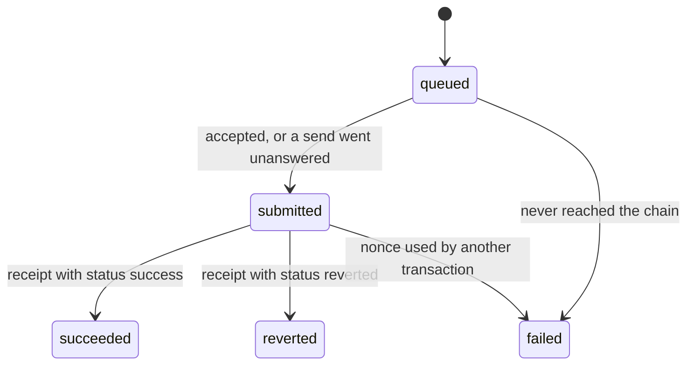

# EVM Transaction Executor

An HTTP service that sends transactions to EVM chains from accounts whose keys it holds. It handles nonces, gas, retries and receipts, so clients only have to say what to send.

A client posts `{ network, sender, to, value, data }` and gets an id back immediately. The service then:

1. estimates gas and prices the fee,
2. assigns a nonce, signs and broadcasts,
3. watches the transaction until a receipt appears, resending it or raising its fee if it gets stuck.

The client polls with the id to get the result.

> **Status:** implemented as designed below. `npm run dev` runs the service; see [Development](#development). The decisions made along the way are in the ADRs.

## Development

Requires Node.js 24+ and [Foundry](https://book.getfoundry.sh/)'s `anvil`, which the integration tests start themselves.

```bash
npm install
```

Four separate checks, each of which must pass:

```bash
npm run typecheck
```

```bash
npm run lint
```

```bash
npm run format:check
```

```bash
npm test
```

`npm run format` fixes formatting. TypeScript is pinned to 6.0 because typescript-eslint's type-aware rules don't support TypeScript 7 yet.

To run the service, copy `.env.example` to `.env`, fill it in, then run:

```bash
npm run dev
```

To run the whole service against a local anvil node, including a 1,000-transfer stress test, see [Localnet testing and results](#localnet-testing-and-results).

### Project layout

```
src/
  main.ts        startup: load and check config, then start the service
  app.ts         HTTP API
  config/        env parsing, defaults, signer registry
  executor/      worker, monitor, nonce pool, gas pricing, broadcast, RPC clients
  store/         SQLite schema and queries
  logger.ts
  types.ts       types shared by the store and the executor
tests/
  unit/          pure logic
  integration/   against a real anvil node, started per test file
  helpers/
scripts/         end-to-end and stress runs against a local anvil node (not part of npm test)
```

## Stack

| Concern | Choice |
|---|---|
| Language and runtime | TypeScript 6.0 on Node.js 24 |
| HTTP | Express |
| Chain access and signing | viem |
| Persistence | SQLite (better-sqlite3) |
| Validation | zod |
| Logging | pino |
| Tests | vitest, with anvil as a local chain |
| Lint and format | ESLint with type-aware typescript-eslint rules; Prettier |

## How it works


| Component | Responsibility |
|---|---|
| **API** | Validates requests, enforces idempotency, stores each request as `queued`, and serves status. Never calls an RPC. |
| **Worker** | Takes each queued request through: estimate gas → price fees → take nonce → sign → save attempt → broadcast. Works on at most `maxInFlightPerSender` requests per sender at a time. |
| **Nonce pools** | One per (chain, sender). Hands out the smallest free nonce. Takes a nonce back only when no node can have the transaction. |
| **Monitor** | One loop per chain. Looks for receipts, resends or fee-bumps stuck transactions, and detects nonces used outside the service. |
| **Store** | SQLite tables `transactions` and `attempts`. The source of truth: nonce pools are rebuilt from it after a restart. |
| **Chain registry** | Built from `RPC_URL_<chainId>` env vars, with optional per-chain settings. Checked against each RPC at startup. |
| **Signer registry** | Maps each sender address to a viem `Account`, built from `SIGNER_PRIVATE_KEYS`. |

### Life of a request

1. **Accept.** `POST /transactions` checks the body, that the chain and sender are configured, and the idempotency key. It stores the request as `queued` and returns `202` with the queued transaction, including its id. No RPC calls happen here.
2. **Estimate and price.** Once the sender has a free slot ([ADR 0012][0012]), the worker estimates gas (plus a buffer) and prices the fee. If the estimate reverts, or the fee is above the chain's cap, the request fails here, before anything is signed.
3. **Take a nonce** from the sender's pool. This happens as late as possible, so earlier failures never touch the pool.
4. **Sign and save.** The signed transaction is saved as an *attempt* **before** it's broadcast.
5. **Broadcast.** If a node accepts it, or any send goes unanswered, the request becomes `submitted` and keeps its nonce. If every send is clearly rejected, no node has it: the nonce is released and the request fails ([ADR 0009][0009]).
6. **Watch.** On every poll the monitor checks receipts for all of the request's attempts, and replaces a stuck transaction with a higher-fee one at the same nonce. When a receipt appears, the request becomes `succeeded` or `reverted`.

### Statuses



| Status | Meaning | Final |
|---|---|---|
| `queued` | Accepted by the API, not broadcast yet. It may be waiting for a free slot for its sender. | no |
| `submitted` | Broadcast; hash known | no |
| `succeeded` | Mined, and execution succeeded | yes |
| `reverted` | Mined, but execution reverted. Gas was spent and the nonce used. The service doesn't retry it. | yes |
| `failed` | Never made it on chain, so no gas was spent. `error.code` says why. | yes |

## API

### Response envelope

Every JSON response has the same three fields, whatever the HTTP status. The HTTP status is set separately, so a client can read the body the same way every time.

```json
{ "status": "ok", "result": { "id": "…", "status": "queued", "…": "…" }, "error": null }
```

```json
{
  "status": "error",
  "result": null,
  "error": { "code": "UNSUPPORTED_NETWORK", "message": "network 1 is not configured", "details": { "supported": [31337] } }
}
```

`error.details` is always present: `null`, or extra information for that code (the failed fields for `VALIDATION_ERROR`, the supported chain ids for `UNSUPPORTED_NETWORK`).

### `POST /transactions`

Requires an `Idempotency-Key` header: 1–255 printable ASCII characters. A UUID is recommended.

```json
{
  "network": 84532,
  "sender": "0x…",
  "to": "0x…",
  "value": "1000000000000000",
  "data": "0x"
}
```

| Field | Type | Notes |
|---|---|---|
| `network` | integer | The chain id, such as `84532` for Base Sepolia. Must be a configured chain; see [ADR 0005][0005]. |
| `sender` | address | Must match one of the configured keys. |
| `to` | address | Required. Contract deployment isn't supported. |
| `value` | string | Wei, as a decimal string. JS numbers lose precision on large amounts. |
| `data` | hex string | Optional. Defaults to `0x`. |

| Case | HTTP status | Envelope |
|---|---|---|
| New key | `202` | `result`: the queued transaction |
| Same key, same body | `200`, plus an `Idempotent-Replayed: true` header | `result`: the existing transaction, in its current status |
| Same key, different body | `422` | `error.code`: `IDEMPOTENCY_KEY_REUSED` |
| Missing key | `400` | `error.code`: `IDEMPOTENCY_KEY_MISSING` |
| Invalid body, or not JSON | `400` | `error.code`: `VALIDATION_ERROR`; `error.details.issues` lists each field |
| Body over 256 kB | `413` | `error.code`: `PAYLOAD_TOO_LARGE` |
| Network not configured | `400` | `error.code`: `UNSUPPORTED_NETWORK`; `error.details.supported` lists the chain ids |
| Sender not configured | `400` | `error.code`: `UNKNOWN_SENDER` |

A new request and a replay return the same transaction shape, so a client handles both the same way.

### `GET /transactions/:id`

Returns the current state of a request in `result` with `200`, or `404` with `error.code` `NOT_FOUND`. Track requests by this id, not by transaction hash, because a fee bump produces a new hash. Example `result`:

```json
{
  "id": "…",
  "status": "succeeded",
  "network": 84532,
  "sender": "0x…",
  "to": "0x…",
  "value": "1000000000000000",
  "data": "0x",
  "nonce": 42,
  "gasLimit": "25200",
  "hash": "0x…",
  "attempts": [
    {
      "hash": "0x…",
      "outcome": "accepted",
      "fees": { "type": "eip1559", "maxFeePerGas": "…", "maxPriorityFeePerGas": "…" },
      "createdAt": "…"
    }
  ],
  "receipt": {
    "transactionHash": "0x…",
    "transactionIndex": 0,
    "blockNumber": "…",
    "blockHash": "0x…",
    "from": "0x…",
    "to": "0x…",
    "contractAddress": null,
    "gasUsed": "21000",
    "cumulativeGasUsed": "21000",
    "effectiveGasPrice": "…",
    "status": "success",
    "type": "eip1559",
    "logsBloom": "0x…",
    "logs": [{ "address": "0x…", "topics": ["0x…"], "data": "0x…", "logIndex": 0 }]
  },
  "failure": null,
  "createdAt": "…",
  "updatedAt": "…"
}
```

- **Every field is always present.** Anything the request doesn't have yet is `null`: `nonce`, `gasLimit` and `hash` until it's signed, `receipt` until it's mined.
- **`hash`** is the attempt that was mined. While the request is still `submitted`, it's the latest attempt.
- **`receipt`** is the node's full receipt, including the emitted `logs` and the `from`, `to` and `transactionIndex`. Addresses are checksummed, and amounts are decimal strings.
- **`failure`** is set when `status` is `failed`: its `code` (see below), a one-line `message`, and the details for that code, such as `capWei` for `FEE_ABOVE_CAP`.
- **Signed transactions are never returned.** One whose nonce is still free could be broadcast by anyone who has it ([ADR 0003][0003]).

### `GET /health`

Returns `Online` as plain text, outside the JSON envelope, while the service is running. It doesn't check RPCs or senders. Stuck transactions and rejected broadcasts show up in the logs.

### Failure codes

| Code | Meaning |
|---|---|
| `ESTIMATION_REVERTED` | Gas estimation reverted. Includes the decoded revert reason. Nothing was broadcast. |
| `FEE_ABOVE_CAP` | The current base fee plus tip is above the chain's fee cap (`MAX_FEE_GWEI_<chainId>`, 500 gwei by default). |
| `RPC_UNAVAILABLE` | The RPC couldn't be reached for gas estimation or fee lookup, even after viem's retries. |
| `INSUFFICIENT_FUNDS` | The node rejected the transaction because the balance can't cover value plus the maximum gas cost. |
| `BROADCAST_REJECTED` | Any other rejection. Includes the node's message. |
| `NONCE_TAKEN` | A transaction from outside the service used this request's nonce. |
| `INTERNAL_ERROR` | Signing or saving failed before anything was sent. |

## Configuration

### Environment

```ini
# One per chain, named by chain id. A comma-separated list sets a fallback order.
RPC_URL_31337=http://127.0.0.1:8545
RPC_URL_84532=https://…

# Optional, per chain. Defaults below.
POLL_INTERVAL_MS_84532=1000
STUCK_AFTER_MS_84532=10000
MAX_FEE_GWEI_84532=0.5

# Comma-separated private keys. Each key's address becomes a sender.
SIGNER_PRIVATE_KEYS=0x…,0x…
```

Setting `RPC_URL_<chainId>` is all it takes to add a chain. Every sender can be used on every enabled chain.

### Per-chain settings

Three settings vary enough between chains to be set per chain, each with an optional env var ([0005]):

| Variable | Default | What it does |
|---|---|---|
| `POLL_INTERVAL_MS_<chainId>` | 2000 | How often the monitor looks for receipts. Set it near the chain's block time. |
| `STUCK_AFTER_MS_<chainId>` | 60000 | How long a transaction can go without a receipt before it's resent or its fee is raised. About 5 blocks ([0008]). |
| `MAX_FEE_GWEI_<chainId>` | 500 | The fee cap. 500 gwei is our own choice, loose enough for mainnet; set a tighter cap per chain ([0007]). |

The rest are the same on every chain, set in `src/config/defaults.ts`: the gas limit buffer, base fee multiplier and minimum tip ([0007]), fee bumps ([0008]), and the in-flight cap ([0012]). The ADRs list each default and where it comes from. The fee type isn't configured: a chain whose latest block has no base fee gets legacy pricing.

### Startup checks

The service refuses to start if:

- no chain or no key is configured;
- a key is malformed or duplicated;
- a per-chain setting is malformed, or is set for a chain with no `RPC_URL_<chainId>`;
- a chain's RPC reports a different `eth_chainId`, or can't be reached to check. This also catches a mistyped chain id.

The startup log lists each chain's settings in effect, without its RPC URLs.

## Edge cases

| Scenario | What happens | ADR |
|---|---|---|
| Many concurrent requests from one sender | Up to `maxInFlightPerSender` (default 16) are processed at once, each with its own nonce from the sender's pool. The rest wait as `queued`. | [0009], [0012] |
| A sender's requests must be mined in order | Not guaranteed. Wait for the first to finish, or configure the chain with a cap of 1. | [0012] |
| Client retries a POST after a timeout | The same `Idempotency-Key` returns the original request; no second transaction | [0010] |
| Same key reused with a different body | `422` | [0010] |
| Transaction would revert | Caught by gas estimation: `failed` with `ESTIMATION_REVERTED`, no gas spent | [0007] |
| Fee spike above the chain's cap | `failed` with `FEE_ABOVE_CAP`. Replacement fees are capped too. | [0007] |
| RPC timeouts, rate limits, 5xx on reads | viem retries with backoff, then moves to the next RPC URL | [0008] |
| RPC down before broadcast | viem retries each read; if it's still down, `failed` with `RPC_UNAVAILABLE`. Nothing was signed. | [0008] |
| Broadcast unanswered: did the node get it? | Nonce kept and request `submitted`. The monitor finds the receipt or resends the same signed transaction. | [0008], [0009] |
| Resending a transaction the node already has | `already known` counts as success | [0008] |
| Broadcast clearly rejected | The request fails. Its nonce goes back to the pool, which resyncs from the chain, and is reused by the next request. | [0009] |
| Transaction stuck in the mempool | Replaced at the same nonce with higher fees, up to `maxBumps` and within the cap | [0008] |
| Transaction dropped from a mempool | Resent or fee-bumped at the same nonce. The nonce never goes back to the pool. | [0008], [0009] |
| Original mined after a replacement was sent | Receipts are checked for every attempt, so either outcome is recognised | [0008] |
| Rolled-back nonce with later nonces in flight | The sender's next request takes that nonce first, which unblocks the later ones | [0009] |
| Parallel broadcasts arrive out of order (`nonce too high`) | The request fails and its nonce goes back to the pool; the client resubmits | [0009] |
| Nonce used outside the service, before our broadcast | The request fails with `nonce too low`. The pool resyncs from the chain, so the next request gets a fresh nonce. | [0009] |
| Nonce used outside the service, after our broadcast | `failed` with `NONCE_TAKEN`; the pool is resynced from the chain | [0001], [0009] |
| Crash between signing and broadcasting | The signed transaction was saved first, so after restart the monitor resends it | [0003] |
| Restart with transactions in flight | Nonce pools are rebuilt from SQLite and the chain | [0009] |
| RPC URL pointing at the wrong chain | The service refuses to start | [0005] |
| Reorg removes a mined transaction | **Not handled.** The first receipt is final. | [0004] |

## Assumptions

- **One instance, and it's the only user of its keys.** Only this process hands out nonces for the configured keys ([0001]). Anything else sending from the same key makes requests fail with `nonce too low` or `NONCE_TAKEN`.
- **Each RPC URL behaves like a single node.** A clear rejection from it means no node took the transaction ([0009]).
- **The first receipt is final.** There is no reorg handling ([0004]).
- **Clients poll and resubmit.** They poll `GET /transactions/:id` for the result ([0002]). When a request fails without reaching the chain, they resubmit it with a new `Idempotency-Key` ([0009]). They wait for one transaction to be mined before sending another that depends on it ([0012]).
- **A trusted network.** There's no authentication, as the spec allows. The service listens on `127.0.0.1` by default.
- **Transfers and contract calls only.** `to` is required, so contracts can't be deployed.
- **Chains.** Standard EVM chains: plain EIP-1559 or legacy transactions over standard JSON-RPC, and every configured RPC is reachable at startup ([0005], [0007]). The 500 gwei default fee cap is meant to be tightened per chain.
- **The spec's `network` field is the chain id,** an integer such as `84532`, not a name such as `base-sepolia` ([0005]).

## Known limitations

- Runs as a single instance, and assumes nothing else sends from its keys ([0001]).
- No reorg handling ([0004]).
- One sender's requests aren't guaranteed to be mined in the order they were sent ([0012]).
- Two dependent transactions sent back to back (approve, then swap) can fail estimation, because the first isn't mined yet ([0007]).
- A sender's queue of waiting requests has no limit ([0012]).
- Node error messages differ between node implementations, so classifying broadcast errors is best effort. Unrecognised errors become `BROADCAST_REJECTED` ([0008]).
- A rejected broadcast fails the request rather than retrying it. The client resubmits with a new key ([0009]).
- If a request is rejected while the same sender's later transactions are in flight, those wait until the sender's next request fills the rejected nonce. With no further requests, they stay in the mempool ([0009]).
- Each RPC URL is assumed to behave like a single node. A load balancer that accepts a tx on one backend and returns another backend's error can leave a request marked `failed` although it ran ([0009]).
- Every configured RPC must be reachable at startup ([0005]).
- No contract deployment, no client-supplied gas or fees, and no batching ([0011]).
- On OP-stack L2s the L1 data fee isn't modelled, so senders need slightly more balance than gas × fee ([0007]).
- Keys come from env vars. Production should use a KMS or a secret manager ([0006]).
- Idempotency keys never expire ([0010]).

## What I'd improve with more time

1. **Throughput on one instance.** The spec's target is hundreds of transactions a second, with more than one per block on every network. The service falls short of that once RPC calls take real time.
   - **Where it stops.** The monitor checks each in-flight transaction with its own RPC calls, one after another, and a sender's slot is only freed when the monitor sees the receipt. So each chain tops out near 1 ÷ RPC latency, however many senders there are. Measured with a variant of the stress script that runs anvil with 2 s blocks and delays every RPC call:

     | RPC delay | Senders | Transfers/s | Accepted → final, p50 |
     |---|---|---|---|
     | 0 ms | 5 | 39 | 5.6 s |
     | 50 ms | 5 | 16 | 12.6 s |
     | 100 ms | 5 | 9 | 22.9 s |
     | 50 ms | 20 | 17 | 23.5 s |

     The 125 transfers/s under [Localnet testing and results](#localnet-testing-and-results) is anvil mining each transaction on arrival and answering in under a millisecond.
   - **Watch blocks, not transactions.** Fetch each new block's transactions once and match them to in-flight requests by sender and nonce. That's one call per block per chain, however many transactions are in flight. A different hash at our sender and nonce is also proof that the nonce was taken, which is safer than the current rule of two polls ([0009]).
   - **Fewer RPC calls per request.** Read fees once per chain per block and share them across requests, and batch JSON-RPC calls.
   - **The in-flight cap per chain.** L2 sequencers often accept more than geth's 16 pending transactions per account ([0012]).
   - **Group SQLite commits.** Each request is committed about five times today, and better-sqlite3 blocks the event loop on every fsync. Buffering writes for a few milliseconds and committing once keeps the save-before-broadcast rule, as long as a broadcast waits for the commit that holds its attempt ([0003]). On a laptop this cut store time from 0.35 to 0.09 ms per transaction.
2. **Thousands of transactions a second.** Ethereum mainnet only fits a few hundred simple transfers a second in total (block gas limit ÷ 12 s ÷ 21,000 gas), so thousands come from many chains, and from more than one process.
   - **Split senders across instances.** Each instance owns a separate set of (chain, sender) pairs through a lease with a fencing token, so two instances never hand out nonces for the same sender ([0001]). A stateless API routes each request to the instance that owns its sender. The nonce pool, saving before broadcast and idempotency are all per sender, so they don't change.
   - **Let the service choose the sender.** When a request names a pool of senders, or none, use the least-loaded one with funds. Each sender is a lane with a fixed rate, so this is the biggest single lever. A pool needs about target tx/s × (block time + detection time) ÷ in-flight cap senders: about 47 for 300 tx/s on Base with a cap of 16.
   - **Sender balances.** Monitor them and top them up from a treasury, since a sender that runs dry fails every request.
   - **Push results instead of polling** ([0002]). A client polling every 250 ms makes about 20 reads per transaction. A server-sent-events stream or a long-poll `GET` removes most of them, and batch endpoints cut the HTTP overhead of submitting and reading.
   - **Backpressure.** A per-sender queue limit that returns `429` ([0012]).
   - **Retention.** Archive final requests. At 1,000 tx/s that's about 86 million rows a day.
   - **Signing off the main thread** if CPU becomes the limit: one signature takes about 0.18 ms here. KMS signing, if keys move there, has rate quotas to plan around ([0006]).
   - **RPC capacity.** Dedicated nodes or enterprise RPC plans, and broadcasting straight to a chain's sequencer where it has a public endpoint.
3. **Reorg safety.** A confirmation depth per chain, with a reorged transaction going back to `submitted` ([0004]).
4. **Fewer failed requests.** Retry `nonce too high` inside the service instead of failing the request, and look up the receipt after a rejection, so load-balanced RPCs are safe too ([0008], [0009]).
5. **A gap filler,** for a sender whose requests stop right after a rejection ([0009]).
6. **Observability.** Metrics for queue depth, in-flight and stuck transactions, fee bumps and latency, and a `/health` that checks each chain's RPC.
7. **Security.** API authentication and rate limits, KMS or HSM signing, and spending limits per key ([0006]).
8. **API.** An expiry for idempotency keys ([0010]), contract deployment, and a client-set gas limit, which also saves an estimate per request. Batching through EIP-7702 is the path if batching is ever needed ([0011]).

## Observability, security and testing

These were open questions in the design and were settled during implementation.

- **Observability:**
  - pino JSON logs, each carrying the `txId` and `chainId` it concerns, plus the `sender`, `nonce` and `hash` where relevant;
  - a line when a request is submitted, mined or fails, when a stuck transaction is replaced or resent, and when a broadcast is rejected;
  - `/health` answers `Online`. There are no metrics.
- **Security beyond keys:**
  - every request is validated with zod, and unknown fields are rejected;
  - request bodies are limited to 256 kB;
  - the service listens on `127.0.0.1` by default, since the API has no auth;
  - responses never include signed transactions, and the SQLite file is treated as sensitive ([0003]).
- **Testing:**
  - vitest unit tests for the pure logic: nonce pool, fee math, error classification, store, config and API;
  - integration tests against anvil, which reproduce stuck transactions (automatic mining off), dropped transactions (`anvil_dropTransaction`), fee spikes (`anvil_setNextBlockBaseFeePerGas`), nonces used outside the service, and restarts;
  - one end-to-end test that starts the real service and uses it over HTTP only.

## Localnet testing and results

Two scripts run the real service against a local anvil node and use it over HTTP only. They're test tools: separate from `src/`, and not part of `npm test`.

```bash
npm run e2e
```

```bash
npm run stress
```

**`npm run e2e`** runs each scenario from the [edge-case table](#edge-cases) once. It uses anvil's test methods to create each condition: mining turned off, a fee spike, a dropped transaction, transactions sent from outside the service, and a restart with a transaction in flight. Latest run: 21 of 21 checks passed.

**`npm run stress`** sends 1,000 transfers from 5 senders twice. The first phase is clean. The second goes through a proxy that injects faults into broadcasts:
- **5% clear rejections**, never forwarded. The request fails, and the client resubmits it with a new key.
- **5% lost replies**, forwarded to anvil and then answered with HTTP 502.
- **2% of signed transactions never delivered**, on any send, so the monitor has to replace them.

Each phase checks:
- **Exactly once:** every transfer has a unique value, so the recipient's balance must rise by exactly their sum.
- **Nonces:** each sender's mined nonces are contiguous and unique, and its on-chain nonce count rose by exactly that many.
- **Records:** every mined request is recorded under the hash that was mined, and the service log has no errors.

For a quicker run, use `TRANSFERS=100 npm run stress`.

Latest results, on a laptop against a local anvil node. They show how the service behaves, not a benchmark. The faulted phase varies between runs, since the faults are random.

| | Clean | Faults injected |
|---|---|---|
| Invariants | All passed | All passed |
| Duration | 8.0 s (125 transfers/s) | 45.8 s (22 transfers/s) |
| Accepted → mined, p50 / p95 | 3.9 s / 6.9 s | 8.4 s / 39.1 s |
| Faults injected | None | 36 rejections, 55 lost replies, 75 blackholed sends |
| Recovery | None | 30 requests resubmitted; 62 needed a replacement |

- **The clean phase's latency is queueing.** All 1,000 requests arrive at once, but at most 80 are in flight (5 senders × a cap of 16). A slot only frees when the monitor sees the receipt, on its 500 ms poll ([0012]).
- **The faulted phase's long tail comes from blackholed transactions.** Each one holds up its sender until the monitor replaces it after `stuckAfterMs`, which the localnet scripts set to 5 s ([0008]).
- **Lost replies never caused a double send.** Every one of them was mined, and the exactly-once check still passed ([0008], [0009]).

## Use of a coding agent

I built this with Claude Code, Anthropic's coding agent, running Claude Opus 5.5.

- **Design before code.** I gave the agent the spec and asked to settle the design before writing any code. We went through sync vs async, persistence, nonce management, gas, retries and idempotency one decision at a time, and each decision became an ADR. The nonce pool is adapted from a Rust implementation I'd built before. Reviewing it with the agent led to the rule the design rests on: a nonce only goes back to the pool when no node can have the transaction.
- **Built in small steps, test first.** Each piece was built test-first: tests written, run to see them fail, then the code. I reviewed each piece before it was committed. The agent ran the type check, lint, tests and local anvil nodes itself.
- **Simplified along the way.** Where the design grew too complex for the scope, I cut it back:
  - a pre-broadcast retry window, several rejection states and the gap filler were removed;
  - a folder restructure was reverted;
  - `/health` became a plain `Online`.
  The ADRs record what was dropped and why.
- **What the agent caught.** For example:
  - viem's `NonceTooLowError` also matches "already known";
  - handing a dropped transaction's nonce to another request can execute a request twice;
  - typescript-eslint doesn't support TypeScript 7 yet.
- **How it was checked.** Unit tests, integration tests against anvil for each edge case, and the end-to-end and stress scripts described above.

My role was the design decisions and reviewing every change. The agent wrote most of the code, tests and docs.

The agent session is included with the submission: **[add the link or file name of the session export]**

## Architecture decision records

Each significant decision is recorded in [`docs/adr/`](docs/adr/) with its context, the alternatives considered, and its consequences.

| ADR | Decision |
|---|---|
| [0001] | Single instance; the service is the only user of its keys |
| [0002] | Asynchronous API: `202` and polling |
| [0003] | SQLite; save each signed transaction before broadcasting it |
| [0004] | The first receipt is final |
| [0005] | Chains identified by chain id, configured from env vars |
| [0006] | Private keys from env vars now; KMS or a secret manager in production |
| [0007] | Gas limit and fee pricing |
| [0008] | Retries and failure handling |
| [0009] | Nonce management with a nonce pool |
| [0010] | Required `Idempotency-Key` |
| [0011] | No request batching |
| [0012] | Per-sender in-flight cap; no ordering guarantee |

[0001]: docs/adr/0001-single-instance-exclusive-keys.md
[0002]: docs/adr/0002-async-api-with-polling.md
[0003]: docs/adr/0003-sqlite-save-before-broadcast.md
[0004]: docs/adr/0004-first-receipt-is-final.md
[0005]: docs/adr/0005-chain-configuration.md
[0006]: docs/adr/0006-private-key-handling.md
[0007]: docs/adr/0007-gas-limit-and-fees.md
[0008]: docs/adr/0008-retries-and-failure-handling.md
[0009]: docs/adr/0009-nonce-pool.md
[0010]: docs/adr/0010-idempotency-key.md
[0011]: docs/adr/0011-no-request-batching.md
[0012]: docs/adr/0012-in-flight-cap.md
